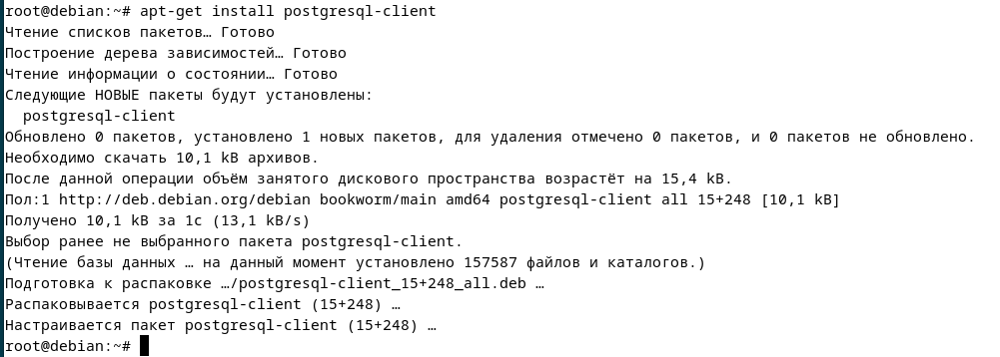
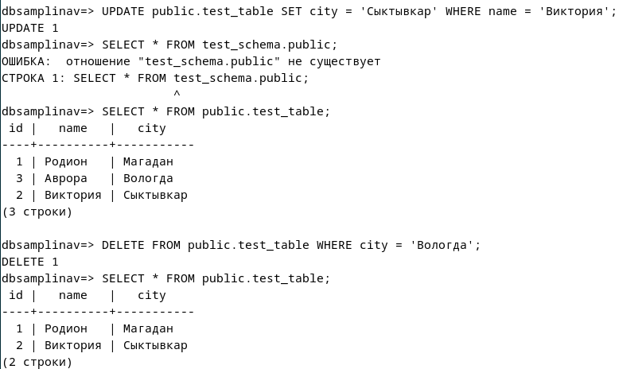

> **Отчет по лабораторной работе №1 базовая настройка PostgreSQL на
> Debian**
>
> **Самплина В.Р. ИС-21**

1.  **Подготовка среды**

1.  apt-get update

Обновляет список доступных пакетов из репозиториев

2.  apt-get upgrade

Устанавливает обновления для всех имеющихся пакетов

2.  **Установка PostgreSQL**

1.  apt-get install postgresql -- установка postgreSQL

2.  apt-get install PostgreSQL-client установка клиентского пакета

3.  systemctl status PostgreSQL -- проверка статуса

3.  **Создание служебной учётной записи**

cat /etc/passwd -- выводит содержимое файла /etc/passwd, где хранятся
сведения о пользователях системы

 

1.  Для администрирования бд заходим под учётку админа sudo -i -u
    postgres

2.  Потом запускаем psql

3.  \\q выход из psql

4.  Exit выход из учётки админа БД

Пользователь postgres в системе:

1.  Не имеет привилегий root, но управляет PostgreSQL.

2.  Обладает полными правами на базы данных PostgreSQL.

3.  Не может использовать sudo, так как это обычный системный
    пользователь.

4.  Может запускать psql без пароля, так как является владельцем сервера
    БД.

 **4. Первичная настройка конфигурационных файлов**

 

ls /etc/postgresql/15

используем для открытия файлов Postgres

 

 ls /etc/postgresql/15/main
 
 Используем для открытия папки main. Для того, чтобы ознакомиться с
 внутренними файлами.

 

 sudo nano /etc/postgresql/15/main/postgresql.conf
 
 Заходим в файл postgresql.conf, редактируем номер порта с 5432 на 5433

 

Для того, чтобы изменения применились, необходимо перезапустить
Postgres. Потом, чтобы убедиться, что Postgres работает проверяем его
статус.

Основные файлы конфигурации:

postgresql.conf -- Основные настройки сервера. Этот файл управляет
параметрами работы PostgreSQL, такими как:

1.  порт (port)

2.  логирование (logging_collector, log_statement)

3.  настройки памяти (shared_buffers, work_mem)

4.  количество подключений (max_connections)

5.  параметры сетевого доступа (listen_addresses)

pg_hba.conf -- настройки аутентификации. Этот файл определяет, какие
пользователи могут подключаться, с каких адресов и с каким методом
аутентификации.

pg_ident.conf -- связывает системных и базовых пользователей. Этот файл
позволяет привязать системные учётные записи Linux к пользователям
PostgreSQL

**5. Управление сервисом**

 

 Проверить статус: systemctl status postgresql

 

 Запустить сервер: sudo systemctl start postgresql

 Остановить сервер: sudo systemctl stop postgresql

 Перезапустить сервер: sudo systemctl restart postgresql

 Добавить в автозапуск: sudo systemctl enable postgresql

 **6. Создание тестовой базы данных**

 

1.  Заходим в Postgresql.

2.  Создаем пользователя с паролем

3.  Создаем бд и привязываем к созданному пользователю

4.  Командой \\du выводим список всех пользователей

5.  Командой \\l выводим список всех бд

psql -U samplinav -d dbsamplinav -W, входим как user samplinav, в бд
dbsamplinav

ошибка: подключиться к серверу через сокет
\"/var/run/postgresql/.s.PGSQL.5433\" не удалось: ВАЖНО: пользователь
\"samplinav\" не прошёл проверку подлинности (Peer). PostgreSQL
использует одноранговый тип аутентификации. Пользователь samplinav не
является системным пользователем Linux.

sudo nano /etc/postgresql/15/main/pg_hba.conf

При помощи этой команды, мы заходим в файл pg_hba.conf и меняем строчку:

local all all peer, на local all all mb5

Peer -- метод аутентификации, при котором проверяется имя пользователя в
системе и в Postgresql. Если они совпадают, то вход выполнится (вход по
паролю не выполнится).

Mb5 -- метод аутентификации, но там не проверяются учетные данные, а
просто происходит вход по паролю (с любой учетки на любую учетку).

**7. Знакомство со схемами**

1.  CREATE SCHEMA test_schema;

2.  GRANT USAGE ON SCHEMA test_schema TO samplinav;

3.  GRANT CREATE ON SCHEMA test_schema TO samplinav;

4.  CREATE TABLE test_schema.test_table

( id SERIAL PRIMARY KEY,

name TEXT NOT NULL );

5.  SELECT \* FROM test_schema.test_table;

> В PostgreSQL схема -- это логическая структура внутри базы данных,
> которая группирует объекты, такие как таблицы, представления, индексы,
> функции и т. д. Схема в PostgreSQL похожа на папку внутри базы данных.
> Она позволяет организовывать объекты и управлять доступом к ним.
> Допустим, у тебя есть база данных company_db. Внутри неё можно создать
> разные схемы:
>
> public -- стандартная схема, куда по умолчанию попадают все объекты.
>
> sales -- таблицы, связанные с продажами.
>
> hr -- таблицы, связанные с персоналом.
>
> Вместо того, чтобы создавать отдельные базы данных для разных отделов,
> можно использовать разные схемы в одной базе данных.

**8. Использование утилиты psql для базовых операций**

Создали таблицу через CREATE, заполнили через INSERT, выбрали через
SELECT \* FROM.

Использовали UPDATE для изменения поля в столбце city. Применили DELETE
для удаления записи со значение city = 'Вологда'.

{width="4.029886264216973in"
height="5.397905730533683in"}

Если выполнить: SELECT \* FROM test_table_sam; PostgreSQL выдаст ошибку,
т.к test_table_sam находится в test_schema, а поиск идёт по схеме
public. Чтобы исправить это, установим search_path: SET search_path TO
test_schema, public; Эта команда меняет поиск по схемам, т.е. меняет
public на test_schema.

Теперь запрос: SELECT \* FROM test_table_sam; будет работать без явного
указания схемы.

**9. Настройка локальных и сетевых подключений**

Находим файл postgresql.conf

sudo nano /etc/postgresql/13/main/postgresql.conf

\'localhost\' -- принимает подключения только с этого компьютера.

\'\*\' -- разрешает подключаться с любого IP-адреса.

Раскомментировали строчку для удаленного подключения (как поняла). По
умолчанию стоит подключение localhost, т.е. подключение может быть
только внутри, а удалённые отклоняются.

{width="5.637972440944882in"
height="2.356649168853893in"}

Добавили строчку подключения в pg_hba.conf, где:

host -- разрешаем подключение по сети (TCP/IP).

all -- разрешаем подключение ко всем базам данных.

all -- разрешаем всем пользователям.

0.0.0.0/0 -- разрешаем доступ всем сетям.

md5 -- метод аутентификации, где требуем вход по паролю.

Перезапускаем PostgreSQL для применения изменений.

Теперь используем команду ss -tulnp \| grep postgres для того, чтобы
получить информацию о сетевых соединениях (проверить какие порты слушает
PostgreSQL)

ss --- это инструмент для отображения сетевых подключений.

Параметры команды ss:

-t --- отображает только TCP соединения.

-u --- отображает только UDP соединения.

-l --- отображает только соединения, которые в данный момент находятся в
состоянии прослушивания (listening), то есть открытые порты, на которых
сервер ожидает входящие соединения.

-n --- отображает IP-адреса и порты в числовом формате, без попытки их
преобразования в имена хостов или сервисов.

-p --- отображает идентификаторы процессов (PID) и соответствующие
программы, которые используют соединения.

Команда grep postgres

grep --- это утилита для поиска строк, которые соответствуют заданному
шаблону. В данном случае мы ищем все строки, содержащие postgres, чтобы
отфильтровать вывод команды ss и получить только те строки, которые
связаны с PostgreSQL.

Переходим в pgAdmin и с локальной машины подключаемся к серверу на
виртуальной машине. Командой hostname -I получаем IP адрес. Дальше
прописываем параметры, которые требуются.

Тут видно, что мы подключились и все отображается.

**10.Журналирование (logging)**

Заходим в postgresql.conf.

sudo nano /etc/postgresql/15/main/postgresql.conf

Убираем комментарии и добавляем строки настроек:

logging_collector = on \# Включает сбор логов (по умолчанию off)

log_directory = \'pg_log\' \# Директория для логов (по умолчанию
\'log\')

log_filename = \'postgresql-%Y-%m-%d.log\' \# Формат имени лог-файлов

log_statement = \'all\' \# Логировать все SQL-запросы

log_connections = on \# Логировать новые подключения

log_disconnections = on \# Логировать отключения клиентов

log_duration = on \# Логировать время выполнения запросов

log_timezone = \'UTC\' \# Устанавливаем временную зону в логах

Таким образом подключаем и настраиваем логирование.

Перезагружаем для применения настроек.

Изначально логи писались в /var/log/postgresql в стандартный каталог
Debian для PostrgeSQL.

После нашей настройки логи стали писаться по пути:

/var/lib/postgresql/15/main/pg_log (папка) куда сохранются уже логи
исключительно PostrgeSQL.

**11.Назначение ролей и прав**

Для начала мы зашли администратором. Создали новую роль limited_user, а
также новую базу данных для проверки функционала. После чего нашей новой
роли выдали права:

Даем пользователю limited_user права на базу данных:

GRANT CONNECT ON DATABASE dblimit TO limited_user;

Даем права на схему:

GRANT USAGE ON SCHEMA public TO limited_user;

Даем права на таблицу aaa:

GRANT SELECT, INSERT, UPDATE ON public.aaa TO limited_user;

Здесь можно увидеть, что распределение прав работает верно, т.к. роли
были выданы права только на вывод, добавление и обновление данных в
таблице ааа, которая в схеме public, которая в свою очередь в dblimit.

Создали роль super. Выдаем все привилегии этой роли на таблицу aaa.
Передаем наследование роли super через GRANT роли limited_user. На
примере DELETE мы видим, что наследование работает.
