> **Отчет по лабораторной работе №2 резервное копирование, 
> восстановление и мониторинг в Debian и PostgreSQL**
> 
>
> **Самплина В.Р. ИС-21**

## **1.  Утилиты резервного копирования**

1\. pg_dump - резервное копирование одной базы данных в виде
SQL-скрипта

pg_dump предназначен для формирования текстового дампа конкретной базы
данных. При его использовании генерируется файл, содержащий
последовательность SQL-команд (например, CREATE, INSERT и т.п.),
необходимых для полного восстановления базы с нуля.

Используем когда:

-   Если требуется сохранить копию лишь одной базы, а не всего сервера.

-   При переносе базы данных на другой сервер или новую установку
    PostgreSQL.

-   Когда нужен редактируемый SQL-дамп, который можно при необходимости
    корректировать до восстановления.

`pg_dump -U postgres -Fc -f backup.dump dbsamplinav`

База **dbsamplinav** экспортируется в сжатый файл **backup.dump**.

2\. pg_basebackup - создание полной копии сервера

pg_basebackup выполняет полное копирование всего сервера PostgreSQL,
включая все базы данных, конфигурационные файлы, журналы транзакций и
файлы данных.

Используем когда:

-   При необходимости создания полного образа сервера, включающего все
    базы и настройки.

-   Для организации репликации, что повышает отказоустойчивость.

-   В ситуациях, требующих быстрого восстановления сервера до состояния,
    зафиксированного в момент копирования

`pg_basebackup -U postgres -D /path/to/backup_dir -Ft`

Объект резервного копирования:

-   pg_dump - копия только одной БД.

-   pg_basebackup - копия всего сервера, все базы, настройки и файлов.

Формат резервной копии:

-   pg_dump - SQL-файл или архив.

-   pg_basebackup - делает физическую копию файлов базы данных.

Размер создаваемой копии:

-   pg_dump занимает меньше места.

-   pg_basebackup занимает больше места.

## **2.  Создание резервной копии**

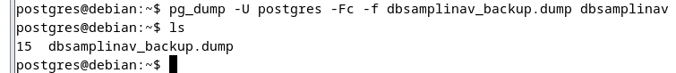

`pg_dump -U postgres -Fc -f dbsamplinav_backup.dump dbsamplinav`

-   -U postgres - указывает пользователя PostgreSQL.

-   -Fc - выбирает формат custom, который автоматически сжимает данные
    и позволяет гибко восстанавливать части дампа при необходимости.

-   -f dbsamplinav_backup.dump - задаёт имя (и путь) выходного файла.

-   dbsamplinav - это название базы данных, которую нужно сохранить.

Форматы резервных копий:

-   -Fp: генерирует обычный текстовый SQL-файл, содержащий команды
    восстановления (CREATE, INSERT и т.д.).

-   -Fc: создаёт custom-архив, который сжимает данные и позволяет
    избирательно восстанавливать объекты.

-   -Ft: формирует tar-архив, удобный для переноса на другие машины.

Выбор объектов для копирования:

-   -t: указывает конкретную таблицу или несколько таблиц

`pg_dump -U postgres -Fc -f backup.dump -t public.users dbsamplinav`

В данном случае экспортируется только таблица **public.users** из базы
**dbsamplinav**.

-   -n: определяет схему, которая должна быть включена в резервную

`pg_dump -U postgres -Fc -f backup.dump -n public dbsamplinav`

Здесь сохраняется всё содержимое схемы **public**.

-   **-T**: исключает определённую таблицу из бэкапа.

`pg_dump -U postgres -Fc -f backup.dump -T public.internal_logs
dbsamplinav`

Таблица **public.internal_logs** не попадёт в резервную копию.

## **3.  Частичное (выборочное) резервное копирование**

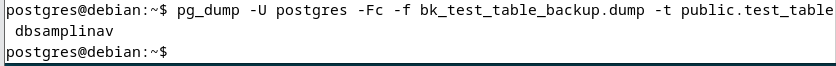

Делаем backup таблицы public.test_table:

``pg_dump -U postgres -Fc -f bk_test_table_backup.dump -t
public.test_table dbsamplinav``

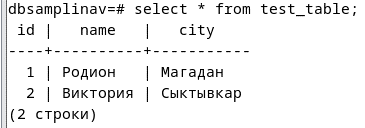

Проверяем

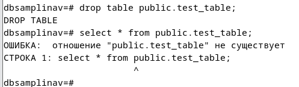

Проверяем удаление таблицы.

## **4.  Восстановление из резервной копии**

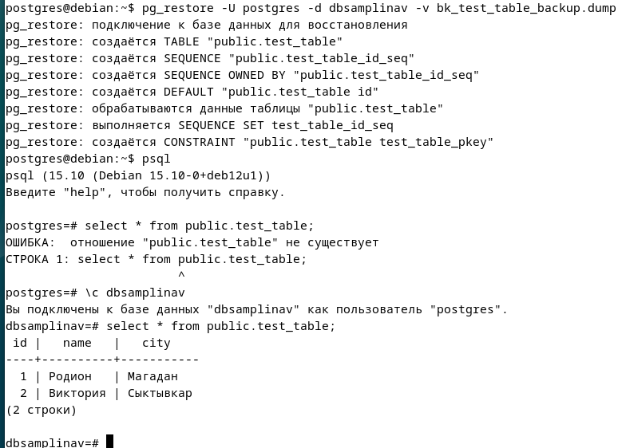

Восстанавливаем таблицу с помощью backup

И следом проверяем работоспособность

## **5.  Автоматизация бэкапов с помощью cron**
Через `Crontab -e` открываем конфигурационный файл
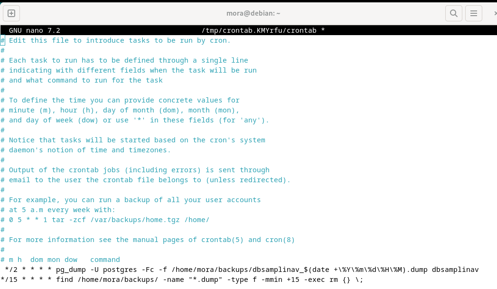

`\*/2 \* \* \* \* pg_dump -U postgres -Fc -f
/home/mora/backups/dbsamplinav\_\$(date +\\%Y\\%m\\%d\\%H\\%M).dump
dbsamplinav`

Каждые 2 минуты будет создаваться бэкап

`\*/15 \* \* \* \* find /home/mora/backups/ -name \"\*.dump\" -type f
-mmin +15 -exec rm {} \\`

Бэкапы старше 15 минут удаляются

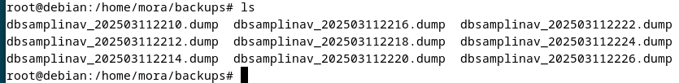

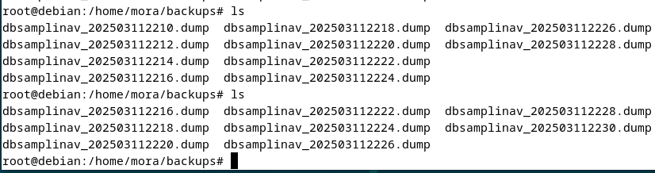

## **6.  Мониторинг состояния системы**

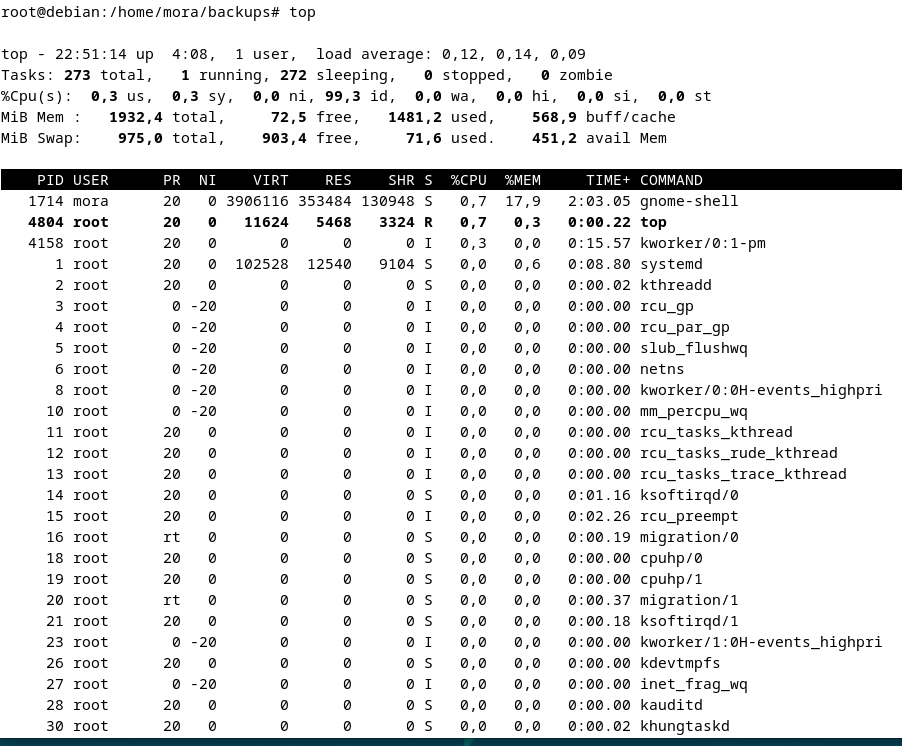

Команда top в реальном времени отображает информацию о запущенных
процессах и использовании системных ресурсов.

Load average - трёхзначный показатель средней загрузки системы за
последние 1, 5 и 15 минут

Всего задач 273, 1 выполняется, 272 в спящем режиме, 0 остановлены, 0
зомби

CPU(s) - процентное соотношение использования центрального процессора
разными категориями процессов (системными, пользовательскими и т.д.).

%Cpu(s): 0,3 us, 0,3 sy, 0,0 ni, 99,3 id, 0,0 wa, 0,0 hi, 0,0 si, 0,0 st

Mem - объём оперативной памяти (RAM), где показано, сколько памяти
занято, свободно и используется под буферы/кэш.

Mib Mem всего 1932,4, свободно 72,5, используется 1481,2,
буферизовано/кэшировано 568,9

Swap - информация о файле/разделе подкачки.

Mib Swap: всего 975,0, свободно 903,4, используется 71,6

PID - идентификатор процесса.

USER - имя пользователя, запустившего процесс.

PR и NI - приоритет и «nice» значение, влияющие на порядок планирования
процессов.

VIRT, RES, SHR - показатели виртуальной, резидентной и разделяемой
памяти, используемой процессом.

%CPU - процент использования CPU конкретным процессом.

%MEM - процент использования оперативной памяти конкретным процессом.

TIME+ - суммарное время работы процесса на CPU.

COMMAND - имя выполняемой команды или процесса.

В таблице видно, что одним из наиболее ресурсозатратных процессов
является gnome-shell, запущенный пользователем mora (PID 1714), который
потребляет некоторый процент CPU и памяти. Остальные процессы, такие как
systemd, различные системные службы и фоновые потоки (rcu_par_gp,
ksoftirqd и т.д.), либо потребляют минимальные ресурсы, либо находятся в
состоянии ожидания (sleeping).

## **7.  Мониторинг PostgreSQL**

pg_stat_activity - мониторинг активных процессов в PostgreSQL.

Показывает все активные соединения, состояния и выполняющиеся запросы.

Чтобы увидеть активные процессы и запросы

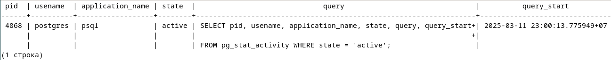

`SELECT pid, usename, application_name, state, query, query_start FROM
pg_stat_activity WHERE state = \'active\';`

pid - id процесса.

usename - имя пользователя, выполняющего запрос.

application_name - название приложения, которое инициировало запрос.

state - состояние процесса

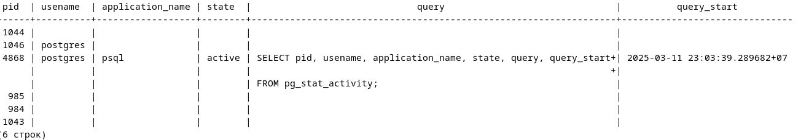

Смотреть все процессы:

`SELECT pid, usename, application_name, state, query, query_start FROM
pg_stat_activity;`

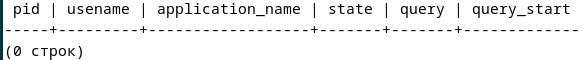

Для поиска запросов, которые выполняются слишком долго, можно
использовать следующую команду:

`SELECT pid, usename, application_name, state, query, query_start FROM
pg_stat_activity WHERE state = \'active\' AND now() - query_start \>
interval \'5 minutes\';`

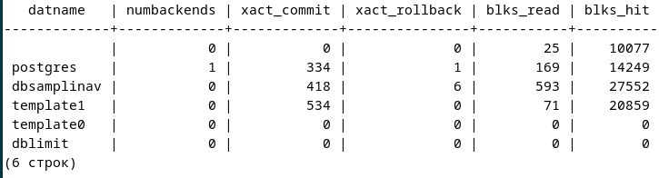

`SELECT datname, numbackends, xact_commit, xact_rollback, blks_read,
blks_hit FROM pg_stat_database;`

pg_stat_database - позволяет получать статистику работы бд в PostgreSQL

datname - имя бд.

numbackends - количество активных подключений (процессов backend),
работающих с этой базой.

xact_commit - количество успешно зафиксированных транзакций.

xact_rollback - количество отменённых транзакций.

blks_read - количество блоков данных, прочитанных с диска.

blks_hit - количество блоков, найденных в кеш-памяти PostgreSQL (shared
buffers), без обращения к диску.

Принудительное завершение запроса:

`SELECT pg_terminate_backend(pid) FROM pg_stat_activity WHERE state =
\'active\' AND now() - query_start \> interval \'5 minutes\';`

Эта команда завершит запросы, которые выполняются дольше 5 минут.

## **8.  Логирование и анализ логов**

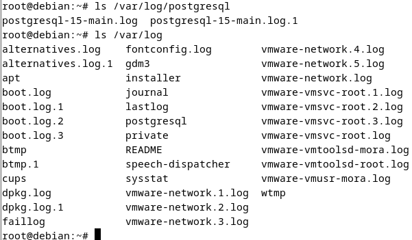

Первой командой указаны логи PostgreSQL

Второй логи дебиана

Логи PostgreSQL фокусируются на событиях, происходящих внутри базы
данных, таких как запросы, ошибки выполнения запросов,
подключение/отключение пользователей и состояние транзакций.

Системные логи Debian содержат информацию о работе самой операционной
системы, включая загрузку системы, работу ядра, ошибки оборудования, а
также работу системных сервисов.
