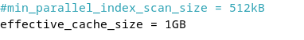
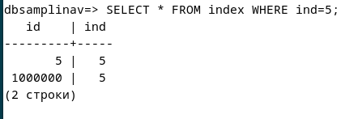

>Отчет по лабораторной работе №3 Расширенные возможности и оптимизация PostgreSQL на Debian
>
>Самплиной В.Р. ИС-21
## **1.  Оптимизация конфигурации PostgreSQL**

 Заходим в postgresql.conf и настраиваем выделение памяти под разные
 процессы.

 >
 >

 **shared_buffers** - размер памяти, выделенной под буферный кэш
 PostgreSQL. Этот кэш хранит данные в оперативной памяти, что помогает
 сократить обращения к диску. Обычно рекомендуется установить этот
 параметр в пределах 25-40% от объёма RAM.

 **work_mem** - объём памяти, используемый для операций сортировки и
 хеширования, таких как ORDER BY, JOIN и DISTINCT. Размер этого
 параметра подбирается с учётом количества запросов, выполняемых
 одновременно.

 **maintenance_work_mem** - память, выделяемая для выполнения служебных
 операций, например, VACUUM и создания индексов (CREATE INDEX).
 Увеличение этого параметра позволяет ускорить выполнение таких задач.
 Обычно его устанавливают в диапазоне 10-15% от RAM.

 **effective_cache_size** - параметр, отражающий оценочное количество
 оперативной памяти, доступной для кэширования данных операционной
 системой перед обращением к диску. Обычно его значение составляет от
 50 до 75% от общего объёма RAM.

 >

 >

 SHOW shared_buffers;

 SHOW work_mem;

 SHOW maintenance_work_mem;

 SHOW effective_cache_size;

## **2.  Создание и анализ индексов**

 Создали таблицу, заполнили данными.

 >

 >

 CREATE TABLE index (id SERIAL PRIMARY KEY, ind INTEGER);

 INSERT INTO index(ind) SELECT generate_series(1, 999999);

 EXPLAIN SELECT \* FROM index WHERE ind = 888888;

 EXPLAIN ANALYZE SELECT \* FROM index WHERE ind = 888888;

 >

 >

 >

 EXPLAIN ANALYZE SELECT \* FROM index WHERE ind = 888888;\
 используется для измерения фактического времени выполнения запроса. В
 отличие от EXPLAIN SELECT \..., которая лишь показывает план
 выполнения запроса без его реального запуска, EXPLAIN ANALYZE SELECT
 \... выполняет запрос и отображает затраченное время.

 После создания индексов время обработки запроса заметно сокращается.
 При отсутствии индекса PostgreSQL выполняет последовательное
 сканирование таблицы (Seq Scan), проходя по каждой строке, сравнивая
 значение столбца ind с 888888 и возвращая совпадающие строки. Если же
 используется индекс (Index Scan), PostgreSQL обращается к нему для
 быстрого поиска нужных строк, извлекая только соответствующие записи.

## **3.  Хранимые функции**

 >

 CREATE OR REPLACE FUNCTION proverka_znach(chislo INTEGER)

 RETURNS TEXT AS \$\$

 BEGIN

 \-- Проверяем, является ли число отрицательным

 IF chislo \< 0 THEN

 RETURN \'Ошибка: отрицательное значение!\';

 ELSE

 \-- Если число положительное, вставляем его в таблицу index

 INSERT INTO index(ind) VALUES (chislo);

 RETURN \'Запись добавлена: \' \|\| chislo;

 END IF;

 END;

 \$\$ LANGUAGE plpgsql;

 >

 >

## **4.  Триггеры**

 CREATE OR REPLACE FUNCTION check_trig()

 RETURNS TRIGGER AS \$\$

 BEGIN

 \-- Если число отрицательное, вызываем ошибку

 IF NEW.ind\< 0 THEN

 RAISE EXCEPTION \'Ошибка: ind не может быть отрицательным!\';

 END IF;

 RETURN NEW;

 END;

 \$\$ LANGUAGE plpgsql;

 >

 >

 ## **5. Автоматическая очистка и статистика (VACUUM, ANALYZE)**

 >

 >

 >

 >

 >

 Автовакуум в PostgreSQL с заданным интервалом (по умолчанию каждые 1
 минуту) проверяет таблицы на наличие «мёртвых» строк. Если объём
 «мусорных» строк достигает 5% от размера таблицы, запускается процесс
 очистки. При изменении 2% строк PostgreSQL обновляет статистику для
 более эффективного планирования запросов.

 Когда в таблицу вносятся изменения (INSERT, UPDATE, DELETE), в ней
 образуются «мёртвые» строки, которые уже не нужны, но продолжают
 занимать место. PostgreSQL не удаляет их автоматически, поэтому
 **VACUUM** освобождает занимаемое ими пространство, а **ANALYZE**
 обновляет статистику, что помогает СУБД строить оптимальные планы
 запросов.

-   **VACUUM index;** - простая очистка таблицы без блокировки, при
    которой «мусорные» строки удаляются, освобождая место.

-   **VACUUM ANALYZE index;** - совмещает очистку и обновление
    статистики, что дополнительно повышает производительность запросов.

 >

 >

 relname - имя таблицы.

 n_live_tup - количество активных (актуальных) строк.

 n_dead_tup - число «мёртвых» строк (чем их больше, тем хуже для
 производительности).

 last_autovacuum - время последнего запуска автоматической очистки
 (autovacuum).

 last_vacuum - время последнего ручного запуска VACUUM.

 >

 relname - имя таблицы.

 indexrelname - имя индекса.

 idx_scan - количество запросов, в которых индекс был задействован.

 idx_tup_read - число строк, считанных с помощью индекса.

 idx_tup_fetch - число строк, фактически извлечённых и использованных
 по индексу.
